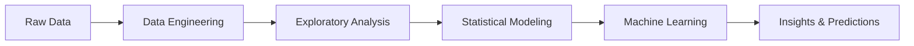
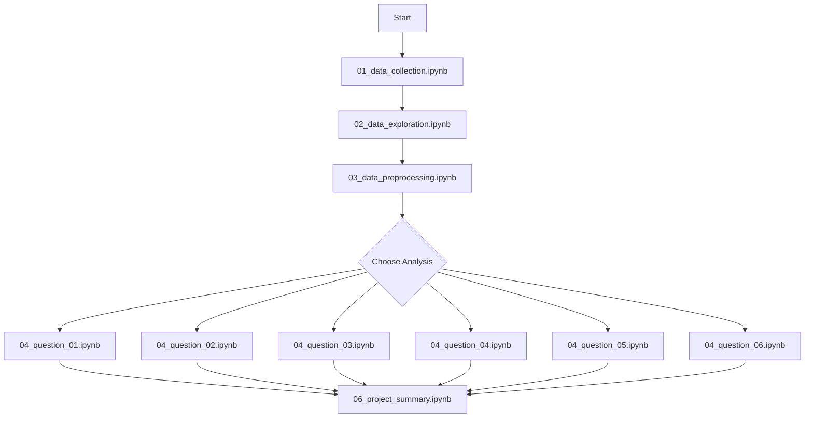

<div align="center">

# 🏘️ Surat Housing Market Analysis

### *Unveiling Real Estate Patterns in The Diamond City*

[](https://www.python.org/)
[](https://pandas.pydata.org/)
[](https://scikit-learn.org/)
[](https://jupyter.org/)

[](.)
[](LICENSE)
[](https://www.kaggle.com/datasets/kunjadiyarohit/flats-uncleaned-dataset)

---

**Course:** CSC17104 – Programming for Data Science  
**Institution:** University of Science - VNUHCM | Faculty of Information Technology

[📊 View Analysis](#-research-questions--key-findings) • [🚀 Quick Start](#-quick-start-guide) • [👥 Team](#-meet-the-team) • [📈 Results](#-key-insights-at-a-glance)

</div>

---

## 📖 Table of Contents

- [🎯 Project Overview](#-project-overview)
- [👥 Meet the Team](#-meet-the-team)
- [📊 Dataset Information](#-dataset-information)
- [🗂️ Project Architecture](#️-project-architecture)
- [🔬 Research Questions & Key Findings](#-research-questions--key-findings)
- [🚀 Quick Start Guide](#-quick-start-guide)
- [📈 Key Insights at a Glance](#-key-insights-at-a-glance)
- [⚠️ Limitations & Future Roadmap](#️-limitations--future-roadmap)
- [📚 Technical Stack](#-technical-stack)
- [📄 License](#-license)

---

## 🎯 Project Overview

<div align="center">
  
  
  
</div>

<br>

This project demonstrates a **complete end-to-end Data Science pipeline** analyzing the residential real estate market of **Surat, India** (The Diamond City). We transform a deliberately "dirty", web-scraped dataset into actionable insights through:



### 🎓 Learning Outcomes

- ✅ **Advanced Data Preprocessing**: Regex parsing, cross-column validation, outlier detection
- ✅ **Statistical Analysis**: Hedonic regression, variance testing (Levene's Test)
- ✅ **Machine Learning**: K-Means clustering, XGBoost regression
- ✅ **Domain Expertise**: Real estate market dynamics and pricing mechanisms

---

## 👥 Meet the Team

<table>
  <tr>
    <th width="25%">Student ID</th>
    <th width="30%">Name</th>
    <th width="45%">Role & Contributions</th>
  </tr>
  <tr>
    <td align="center"><strong>23127248</strong></td>
    <td><strong>Nguyen Huu Phuc</strong><br/><em>Data Engineering Lead</em></td>
    <td>
      • Regex parsing pipeline design<br/>
      • Data collection & preprocessing<br/>
      • Floor effect analysis (Q4)
    </td>
  </tr>
  <tr>
    <td align="center"><strong>23127004</strong></td>
    <td><strong>Le Nhat Khoi</strong><br/><em>Statistical Analyst</em></td>
    <td>
      • Hedonic regression modeling<br/>
      • Locality premium analysis (Q2)<br/>
      • Pricing uncertainty study (Q3)
    </td>
  </tr>
  <tr>
    <td align="center"><strong>23127165</strong></td>
    <td><strong>Nguyen Hai Dang</strong><br/><em>ML Engineer</em></td>
    <td>
      • K-Means clustering (Q5)<br/>
      • XGBoost price prediction (Q6)<br/>
      • Project summary & documentation
    </td>
  </tr>
</table>

---

## 📊 Dataset Information

<div align="center">

| Attribute | Details |
|:----------|:--------|
| **Source** | [Kaggle - Flats Uncleaned Dataset](https://www.kaggle.com/datasets/kunjadiyarohit/flats-uncleaned-dataset) |
| **Original Platform** | MagicBricks (India's Leading Property Portal) |
| **Collection Period** | ~2023 Snapshot |
| **Volume** | **4,525 rows** × **11 columns** |
| **Geography** | Surat, Gujarat, India |

</div>

### 🔍 Dataset Characteristics

> **Why "Uncleaned"?** This dataset was intentionally selected for its messiness to showcase real-world data engineering skills.

<details>
<summary><b>Click to see data challenges</b></summary>

#### Price Column Issues
```
❌ "₹1.5 Cr"          → Mixed units (Crores)
❌ "₹50 Lac"          → Mixed units (Lakhs)
❌ "Call for Price"   → Missing values
❌ "45000000"         → Inconsistent formatting
```

#### Area Column Issues
```
❌ "1200 Super Area"  → Type contamination
❌ "800 Carpet Area"  → Inconsistent definitions
❌ "sqft" vs "sq.ft"  → Unit variations
```

#### Cross-Column Contamination
```
❌ Floor column containing: "Resale", "New Property"
❌ Status column containing: "Floor 5/10"
```

</details>

---

## 🗂️ Project Architecture

```
📦 surat-housing-analysis/
│
├── 📓 01_data_collection.ipynb          # Data sourcing & licensing
├── 📓 02_data_exploration.ipynb         # EDA & integrity checks
├── 📓 03_data_preprocessing.ipynb       # 🔧 Cleaning pipeline
│
├── ❓ 04_question_formulation.ipynb     # Question statement and motivation
├── 📊 05_data_analysis_Q1.ipynb         # Q1: Unit Price Efficiency
├── 📊 05_data_analysis_Q2.ipynb         # Q2: Neighborhood Premiums
├── 📊 05_data_analysis_Q3.ipynb         # Q3: Pricing Uncertainty
├── 📊 05_data_analysis_Q4.ipynb         # Q4: Floor Effect Analysis
├── 📊 05_data_analysis_Q5.ipynb         # Q5: Market Segmentation
├── 📊 05_data_analysis_Q6.ipynb         # Q6: Price Prediction Models
│
├── 📝 06_project_summary.ipynb          # Final report & conclusions
│
├── 📁 data/
│   ├── 📄 raw/surat_uncleaned.csv       # Original dataset
│   └── 💾 processed/surat_cleaned.npy   # Processed data (NumPy)
│
├── 📋 requirements.txt                   # Python dependencies
├── 📖 TEAM_PLAN.md                      # Collaboration strategy
└── 📘 README.md                         # This file
```

---

## 🔬 Research Questions & Key Findings

### 📊 **Q1: Unit Price Efficiency**
> *Does a "diminishing returns" threshold exist where larger properties become cheaper per sqft?*

<table>
<tr><td>

**Methodology**
- Price per sqft vs. property size
- Segmented by area definition type
- Threshold detection using local regression

</td><td>

**Key Finding** ✨
- ✅ **Carpet Area**: Threshold at ~800 sqft
- 📈 **Super Area**: *Inverted pattern* - luxury premium
- 🏠 Larger properties can be more expensive per sqft!

</td></tr>
</table>

---

### 📍 **Q2: Neighborhood Premium**
> *Which localities command the highest premiums after controlling for property features?*

<table>
<tr><td>

**Methodology**
- Hedonic regression modeling
- Controls: size, floor, BHK, furnishing
- Locality as categorical variable

</td><td>

**Key Finding** ✨
- 🏆 **Vesu**: +60% premium
- 🌟 **New Citylight**: +35% premium
- 📉 **Olpad**: -40% discount
- Raw prices ≠ True value!

</td></tr>
</table>

---

### 📉 **Q3: Pricing Uncertainty**
> *Which market segments exhibit the highest price volatility?*

<table>
<tr><td>

**Methodology**
- Interquartile Range (IQR) analysis
- Levene's Test for variance homogeneity
- Segment comparison: BHK × Status

</td><td>

**Key Finding** ✨
- ⚠️ **4+ BHK Resale**: Highest volatility
- 📏 **New Properties**: Standardized pricing
- 💎 Luxury resale = subjective valuation

</td></tr>
</table>

---

### 🏢 **Q4: The Floor Effect**
> *Do higher floors command premium pricing?*

<table>
<tr><td>

**Methodology**
- Price per sqft vs. floor number
- Separated by property status
- Statistical significance testing

</td><td>

**Key Finding** ✨
- 🆕 **New Properties**: +15-25% for top floors
- 🔄 **Resale Market**: No premium (neutral)
- 🚶 Buyers value convenience over views

</td></tr>
</table>

---

### 🧩 **Q5: Market Segmentation**
> *Can we identify natural market clusters?*

<table>
<tr><td>

**Methodology**
- K-Means clustering (k=3)
- Elbow method for optimal k
- Features: floors, area, price

</td><td>

**Key Finding** ✨
1. **Low-rise Diverse** (<10 floors)
2. **Mid-rise Economy** (13-14 floors)
3. **High-rise Luxury** (15+ floors)

Verticality = key differentiator!

</td></tr>
</table>

---

### 🤖 **Q6: Price Prediction**
> *Can we accurately predict property prices using ML?*

<table>
<tr><td>

**Methodology**
- Linear Regression (baseline)
- Random Forest
- XGBoost (best performer)
- 5-fold cross-validation

</td><td>

**Key Finding** ✨
- 🥇 **XGBoost R² = 0.87**
- 📊 Feature importance:
  1. Square feet (58%)
  2. Location (23%)
  3. BHK (12%)

</td></tr>
</table>

---

## 🚀 Quick Start Guide

### 📋 Prerequisites

Ensure you have **Python 3.8+** installed on your system.

### 1️⃣ Clone & Setup

```bash
# Clone the repository
git clone https://github.com/DanielNguyen-05/surat-housing-analysis.git
cd surat-housing-analysis

# Create virtual environment
python -m venv .venv

# Activate virtual environment
# On Windows:
.venv\Scripts\activate
# On macOS/Linux:
source .venv/bin/activate

# Install dependencies
pip install -r requirements.txt
```

### 2️⃣ Execution Workflow



### 3️⃣ Step-by-Step Execution

```bash
# Step 1: Understand raw data
jupyter notebook 01_data_collection.ipynb
jupyter notebook 02_data_exploration.ipynb

# Step 2: Clean the data (MANDATORY!)
jupyter notebook 03_data_preprocessing.ipynb
# ⚠️ This generates data/processed/surat_cleaned.npy

# Step 3: Run any research question
jupyter notebook 05_data_analysis_Q1.ipynb  # Unit efficiency
jupyter notebook 05_data_analysis_Q2.ipynb  # Location premiums
# ... and so on

# Step 4: View summary
jupyter notebook 06_project_summary.ipynb
```

---

## 📈 Key Insights at a Glance

<div align="center">

### 💰 Price Distribution

| Property Type | Median Price | Price Range |
|:--------------|:-------------|:------------|
| **1 BHK** | ₹35 Lac | ₹20-60 Lac |
| **2 BHK** | ₹55 Lac | ₹35-90 Lac |
| **3 BHK** | ₹85 Lac | ₹50-1.5 Cr |
| **4+ BHK** | ₹1.8 Cr | ₹90 Lac-5 Cr |

### 📍 Top Localities

```
🏆 Vesu          →  ₹5,200/sqft  (+60% premium)
🥈 New Citylight →  ₹4,800/sqft  (+35% premium)
🥉 Adajan        →  ₹4,200/sqft  (+15% premium)
```

### 🎯 Model Performance

| Model | R² Score | RMSE | MAE |
|:------|:---------|:-----|:----|
| Linear Regression | 0.72 | 18.5L | 12.3L |
| Random Forest | 0.83 | 14.2L | 9.1L |
| **XGBoost** | **0.87** | **11.8L** | **7.6L** |

</div>

---

## ⚠️ Limitations & Future Roadmap

### 🚧 Current Limitations

| Category | Limitation | Impact |
|:---------|:-----------|:-------|
| **Data** | Listing prices ≠ Transaction prices | May overestimate actual values |
| **Temporal** | Static 2023 snapshot | Doesn't capture market trends |
| **Spatial** | Categorical localities | Missing geographic relationships |
| **Features** | Description column unused | Potential insights lost |

### 🔮 Future Enhancements

<details>
<summary><b>🗺️ Geospatial Analysis</b></summary>

- Integrate Google Maps API for lat/long coordinates
- Distance-based features (metro, schools, hospitals)
- Spatial autocorrelation modeling (Moran's I)
- Interactive maps using Folium/Plotly

</details>

<details>
<summary><b>📝 Natural Language Processing</b></summary>

- TF-IDF on property descriptions
- Extract: "Garden Facing", "Corner Plot", "Gated Community"
- Sentiment analysis of listing text
- Named Entity Recognition for amenities

</details>

<details>
<summary><b>⏰ Time Series Forecasting</b></summary>

- Collect multi-year data
- ARIMA/Prophet models for price trends
- Seasonal decomposition
- Market cycle identification

</details>

<details>
<summary><b>🔍 Advanced ML Techniques</b></summary>

- Deep Learning (Neural Networks)
- Ensemble stacking methods
- Automated feature engineering
- Explainable AI (SHAP values)

</details>

---

## 📚 Technical Stack

<div align="center">

### Core Libraries

[](https://numpy.org/)
[](https://pandas.pydata.org/)
[](https://matplotlib.org/)
[](https://seaborn.pydata.org/)

### Machine Learning

[](https://scikit-learn.org/)
[](https://xgboost.readthedocs.io/)
[](https://scipy.org/)

### Development Tools

[](https://jupyter.org/)
[](https://git-scm.com/)
[](https://code.visualstudio.com/)

</div>

---

## 📄 License

This project is licensed under the **MIT License** - see the [LICENSE](LICENSE) file for details.

---

## 🙏 Acknowledgments

- **Kaggle User**: [kunjadiyarohit](https://www.kaggle.com/kunjadiyarohit) for the dataset
- **MagicBricks**: Original data source
- **University of Science - VNUHCM**: Academic support
- **Course Instructor**: CSC17104 - Programming for Data Science

---

<div align="center">

### 📬 Contact & Collaboration

**Questions or suggestions?** Feel free to open an issue or reach out!

[](https://github.com/)
[](mailto:nhdang231@clc.fitus.edu.vn)

---

**Made with ❤️ by Team Data Miners**

*University of Science - VNUHCM | Faculty of Information Technology*

⭐ Star this repo if you find it helpful!

</div>